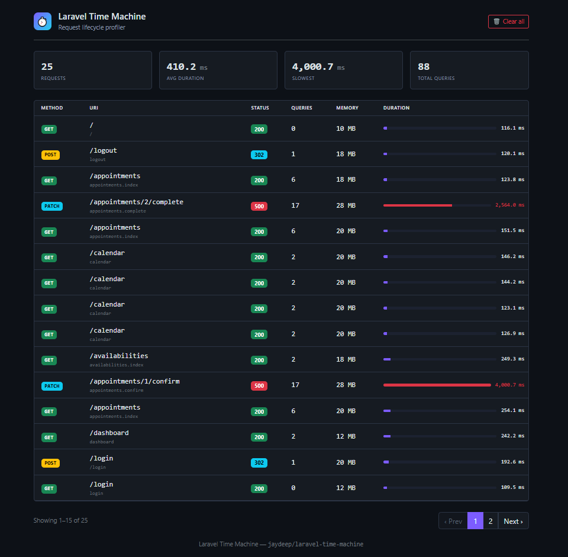
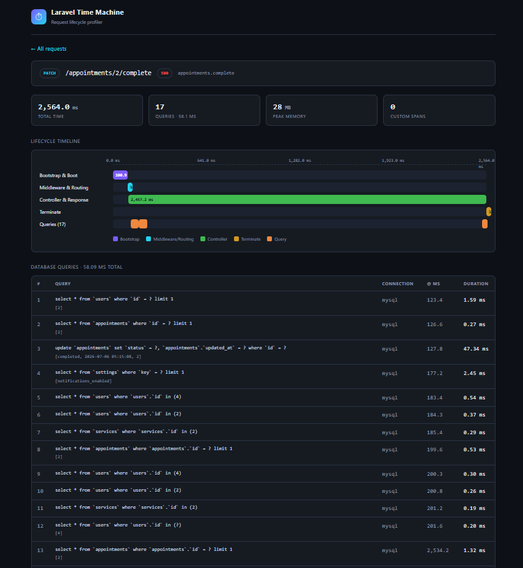

# ⏱ Laravel Time Machine — Request Lifecycle Profiler & Performance Debugger for Laravel

> **Profile, debug and visualize every Laravel request** — from framework boot to response — with a millisecond-accurate Gantt timeline, full SQL query profiling and a beautiful zero-config dashboard.

[](https://packagist.org/packages/jaydeep/laravel-time-machine)
[](https://packagist.org/packages/jaydeep/laravel-time-machine)
[](https://packagist.org/packages/jaydeep/laravel-time-machine)
[](https://laravel.com)
[](LICENSE)

**Laravel Time Machine** is a lightweight, drop-in **Laravel performance profiler and request debugger**. It answers one simple question that every developer asks — *"Where did all the time go in this request?"* — by breaking down the complete request lifecycle into a clear, interactive timeline. Find slow queries, N+1 problems, heavy middleware and sluggish controllers in seconds, without adding a single line of setup code.

If this package saves you some debugging time, kindly **⭐ star the repository** — it really helps others discover it too!

**Request list** — all your recent requests with duration, query count, memory and status, at one glance:



**Request detail** — a Gantt-style lifecycle timeline along with every database query:



---

## 📑 Table of Contents

- [Why Laravel Time Machine?](#-why-laravel-time-machine)
- [Features](#-features)
- [Installation](#-installation)
- [Usage](#-usage)
- [Instrument your own code](#instrument-your-own-code)
- [Configuration](#-configuration)
- [How it works](#-how-it-works)
- [Time Machine vs Telescope vs Debugbar](#-time-machine-vs-telescope-vs-debugbar)
- [FAQ](#-faq)
- [Requirements](#-requirements)
- [Contributing](#-contributing)
- [License](#-license)

---

## 🤔 Why Laravel Time Machine?

Debugging slow Laravel requests usually means guessing, adding random `microtime()` calls, or setting up a heavy monitoring stack. Laravel Time Machine gives you the full picture instantly:

- ✅ **Zero configuration** — install and it just works. No service registration, no asset build, no external service.
- ✅ **See the whole lifecycle** — boot, middleware, routing, controller, response and terminate, each measured to the millisecond.
- ✅ **Catch slow & N+1 queries** — every SQL statement is captured with bindings, connection and duration, and slow ones are highlighted automatically.
- ✅ **Self-hosted & private** — profiles are stored as plain JSON files in your own `storage/` folder. Nothing leaves your server.
- ✅ **Production-safe** — completely off unless you switch it on, so there is zero overhead when disabled.

**Perfect for:** optimizing slow endpoints, hunting N+1 queries, understanding a new codebase, teaching how Laravel handles a request, and profiling APIs during development.

## ✨ Features

- 🧭 **Full lifecycle timeline** — Bootstrap & Boot → Middleware & Routing → Controller & Response → Terminate, each one measured upto the millisecond.
- 🗄 **Query profiling** — every single SQL statement is captured with its bindings, connection, offset on the timeline and duration (slow queries are highlighted for you).
- 📌 **Custom spans & marks** — instrument your own code using just a one-line facade.
- 📊 **Visual dashboard** — a self-contained web UI that lists your recent requests with a Gantt-style timeline detail view. No asset compilation is required, it works out of the box.
- 🧠 **Performance insights** — total time, peak memory, query count/time and slow-request flagging, all in one place.
- 🪶 **Zero overhead when disabled** — it stays off in production by default, so nothing gets recorded and nothing gets rendered.

## 📦 Installation

Require the package via Composer:

```bash
composer require jaydeep/laravel-time-machine
```

The service provider and the `TimeMachine` facade get auto-discovered, so no manual registration is needed. If you want to tune the settings, publish the config file:

```bash
php artisan vendor:publish --tag=time-machine-config
```

That's it. You are good to go. 🎉

## 🚀 Usage

By default, Time Machine remains active whenever `APP_DEBUG=true`. Just browse your app as usual and then open the dashboard:

```
http://your-app.test/time-machine
```

Every non-ignored HTTP request is recorded automatically — you don't have to do anything extra. Click on any request to see its full lifecycle timeline, queries and marks.

### Instrument your own code

Want to profile a specific portion of your code? The same can be done easily using the facade:

```php
use Jaydeep\LaravelTimeMachine\Facades\TimeMachine;

// Drop a marker on the timeline
TimeMachine::mark('cache primed');

// Time a block of code as a span
$report = TimeMachine::measure('generate-report', function () {
    return Report::build();
});

// Or open and close it manually
TimeMachine::startSpan('external-api');
$response = Http::get('https://api.example.com');
TimeMachine::endSpan('external-api');
```

## ⚙️ Configuration

All the settings live in `config/time-machine.php` (env keys are given in brackets):

| Key | Default | Purpose |
|-----|---------|---------|
| `enabled` `[TIME_MACHINE_ENABLED]` | follows `APP_DEBUG` | Master on/off switch |
| `dashboard.path` `[TIME_MACHINE_PATH]` | `time-machine` | Dashboard URI prefix |
| `dashboard.middleware` | `['web']` | Guards the dashboard (add `auth` in production) |
| `storage.max_records` `[TIME_MACHINE_MAX_RECORDS]` | `100` | Profiles retained (oldest ones are pruned) |
| `storage.path` | `storage/time-machine` | Where the profiles are written |
| `collectors.queries` | `true` | Capture DB queries |
| `ignore_paths` | assets, telescope… | Paths that are never profiled (wildcards allowed) |
| `thresholds.slow_request` / `slow_query` | `500` / `50` ms | Used for UI highlighting |

> **Production tip:** In case you enable it in production, lock down the dashboard with an `auth` middleware via `dashboard.middleware`. Otherwise your profiling data will be exposed to everyone, which we don't want.

## 🔍 How it works

Internally, Time Machine anchors the whole timeline to `LARAVEL_START` and then records the phase boundaries from various framework hooks and events:

- `LARAVEL_START` → boot start
- `Application::booted()` → providers booted
- `RouteMatched` event → routing complete
- `RequestHandled` event → response ready
- A prepended global middleware's `terminate()` → request finished, profile persisted

The queries are captured via the `QueryExecuted` event. After that, everything is flattened into millisecond offsets and stored as one JSON file per request. Simple and clean.

## 🆚 Time Machine vs Telescope vs Debugbar

| | **Laravel Time Machine** | Laravel Telescope | Laravel Debugbar |
|---|:---:|:---:|:---:|
| Full lifecycle Gantt timeline | ✅ | ❌ | ❌ |
| Zero config / no asset build | ✅ | ❌ | ✅ |
| Database (no DB tables needed) | ✅ (JSON files) | ❌ (needs migrations) | ✅ |
| Per-request query profiling | ✅ | ✅ | ✅ |
| Self-hosted & private | ✅ | ✅ | ✅ |
| Lightweight footprint | ✅ | Heavy | Medium |

Time Machine is intentionally focused: it does **request lifecycle profiling** extremely well, without the weight of a full monitoring suite.

## ❓ FAQ

**Does it slow down my application?**
No. When disabled it records nothing and adds virtually zero overhead. It is off in production by default.

**Do I need a database or migrations?**
Not at all. Profiles are stored as plain JSON files under `storage/time-machine`, so there is nothing to migrate.

**Is it safe to run in production?**
Yes, but keep it disabled unless you are actively debugging, and always protect the dashboard with an `auth` middleware if you do enable it.

**Which Laravel and PHP versions are supported?**
Every Laravel version from 8 right up to the latest 13, on PHP 7.4 and 8.x. (Do note that Laravel 11+ needs PHP 8.2+ and Laravel 13 needs PHP 8.3+, as per Laravel's own requirements.)

## ✅ Requirements

- PHP 7.4+ / 8.x
- Laravel 8, 9, 10, 11, 12 or 13 (the latest)

## 🤝 Contributing

Contributions, bug reports and feature requests are most welcome! In case you face any issue or have some suggestion, kindly [open an issue](../../issues) or send a pull request, and I will surely revert back.

If you find this package useful, please consider **⭐ starring the repo** and sharing it with fellow Laravel developers — it goes a long way in helping the project grow.

## 📄 License

MIT © [Jaydeep Gadhiya](https://packagist.org/packages/jaydeep/laravel-time-machine)

---

<sub>**Keywords:** laravel profiler · laravel performance · laravel request lifecycle · laravel debugging · laravel query profiler · laravel timeline · laravel debug bar alternative · laravel telescope alternative · php performance profiling · slow query detection · n+1 query detection</sub>

